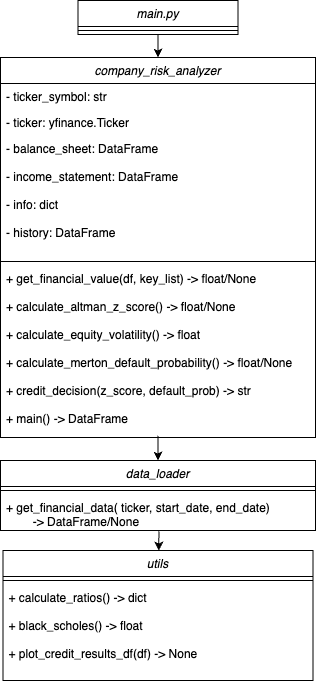

# Credit Risk Analysis with Altman Z-Score and Merton Model

This project implements a credit risk analysis for stock market companies by applying two different models:

1. **Altman Z-Score**  
2. **Merton Model**

The goal is to assess the financial health and bankruptcy risk of companies using real financial data downloaded from [Yahoo Finance](https://finance.yahoo.com/) via the `yfinance` library. The analysis computes key ratios, estimates the probability of default, and produces a simple credit decision ("Approved" or "Denied").

---

## Project Overview

This project is designed to meet the following objectives:
- **Download financial data online**: Automatically retrieve financial statements and historical price data from Yahoo Finance.
- **Calculate risk models**: Compute the Altman Z-Score and estimate default probability using the Merton Model.
- **Decision-making function**: Return a simple credit decision based on model outputs.
- **Object-oriented and functional design**: The code is organized into classes and functions for clarity and reusability.
- **Visual representation (Optional)**: Utility functions are provided for plotting the results.

---

## Project Structure flowchart




### File Descriptions

- **`main.py`**  
  The entry point of the application. It calls the `main()` function from `company_risk_analyzer.py`.

- **`company_risk_analyzer.py`**  
  Contains the `CompanyRiskAnalyzer` class, which:
  - Prompts the user for ticker symbols (allowing any number, comma-separated) and an optional historical date range.
  - Downloads the latest financial data (using `yfinance` and, if specified, `DataLoader`).
  - Calculates the Altman Z-Score and the default probability based on the Merton Model.
  - Provides a simple credit decision based on predefined thresholds.
  - Returns a DataFrame with the analysis results.

- **`data_loader.py`**  
  Defines the `DataLoader` class, responsible for downloading historical financial data when specific start and end dates are provided.

- **`utils.py`**  
  Contains auxiliary functions:
  - `calculate_ratios`: Computes financial ratios for the Altman Z-Score.
  - `black_scholes`: Calculates European call option prices using the Black-Scholes formula.
  - `plot_credit_results_df`: Plots a grouped bar chart to visualize the credit risk metrics.

- **`__init__.py`**  
  Exposes the key modules and functions as part of the package.

---

## Model Explanations

### Altman Z-Score

The **Altman Z-Score** is a formula developed by Edward Altman in 1968 to predict the probability that a company will go bankrupt within two years. It uses five financial ratios derived from a company’s financial statements. The formula is given by:

$$
Z = 1.2 \times \left(\frac{\text{Working Capital}}{\text{Total Assets}}\right)
  + 1.4 \times \left(\frac{\text{Retained Earnings}}{\text{Total Assets}}\right)
  + 3.3 \times \left(\frac{\text{EBIT}}{\text{Total Assets}}\right)
  + 0.6 \times \left(\frac{\text{Market Value of Equity}}{\text{Total Liabilities}}\right)
  + 1.0 \times \left(\frac{\text{Sales}}{\text{Total Assets}}\right)
$$

**Key Components:**
- **Working Capital / Total Assets**: Measures liquidity.
- **Retained Earnings / Total Assets**: Reflects cumulative profitability and reinvestment.
- **EBIT / Total Assets**: Indicates operating efficiency.
- **Market Value of Equity / Total Liabilities**: Reflects leverage and market confidence.
- **Sales / Total Assets**: Measures asset turnover.

**Thresholds:**
- **Z < 1.8**: High bankruptcy risk.
- **1.8 ≤ Z < 3.0**: Medium risk.
- **Z ≥ 3.0**: Low bankruptcy risk.

> **Version Used:**  
> This project uses the classic Altman Z-Score version originally designed for publicly traded manufacturing companies. Adjustments to coefficients might be needed for different industries.

---

### Merton Model

The **Merton Model**, introduced by Robert C. Merton in 1974, models a company’s equity as a call option on its assets. The key assumptions are:
- The equity of the firm is equivalent to a European call option on its assets.
- The firm’s debt is modeled as a zero-coupon bond.

**Default Probability Calculation:**  
Using the Black-Scholes framework, the default probability is estimated by:

$$d_2 = (\frac{Ln(\frac{V}{D})-0.5\sigma^2T}{\sigma \sqrt T})$$

$$
\text{Default Probability =} N(-d_2)
$$


Where:
- \( $V$ \) = Total asset value (approximated as *Market Cap + Total Liabilities*)
- \( $D$ \) = Total Liabilities (the face value of debt)
- \( $\sigma$ \) = Annualized volatility (approximated from equity volatility)
- \( $T$ \) = Time to maturity (in years)

> **Interpretation:**  
> A higher default probability implies a higher risk of insolvency. In this project, a default probability below 5% combined with an Altman Z-Score of 3 or higher is considered "Approved"; otherwise, it is "Denied."

---

## Data Source

Financial data, including balance sheets, income statements, and historical stock prices, are retrieved from **[Yahoo Finance](https://finance.yahoo.com/)** using the `yfinance` library. When you input a ticker symbol (e.g., `AAPL`), the most recent available data is automatically downloaded and processed.

---

## How to Run

### Prerequisites

- **Python 3.x**
- Install dependencies with:
  ```bash
  pip install -r requirements.txt
